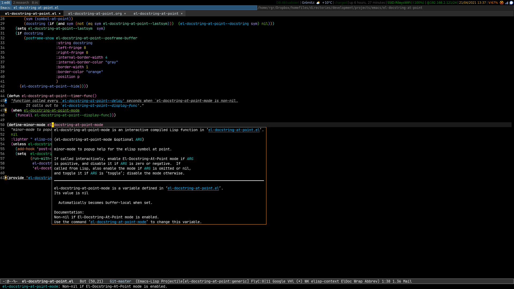
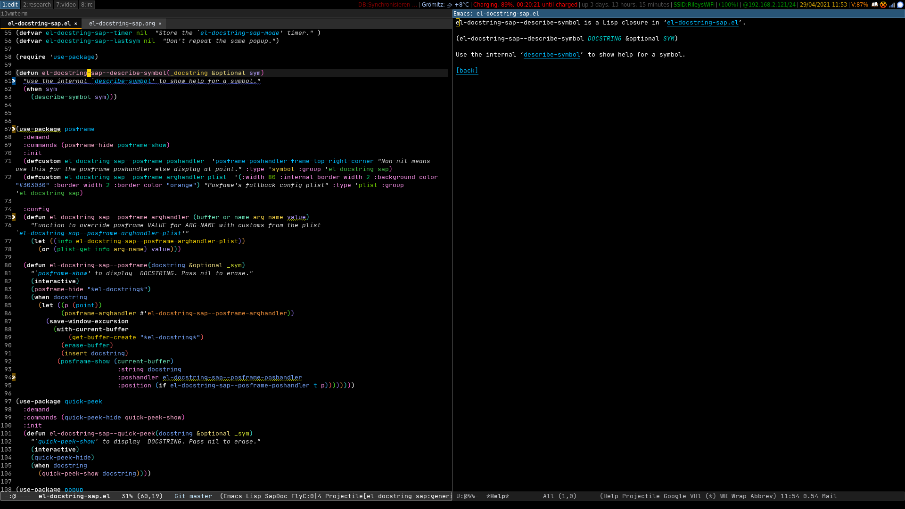
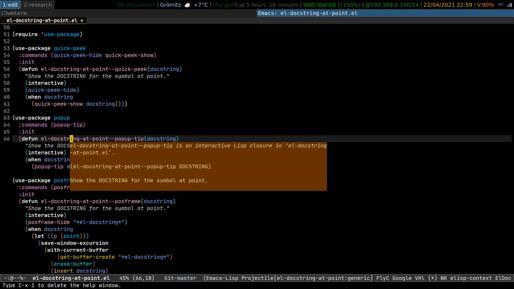

- [Introduction](#org05f0b2c)
- [Installation](#org1973e25)
  - [use-package](#org7a4a856)
- [Configuration](#org9b9e36c)
  - [Enabling the minor mode](#orgc4e0690)
  - [Manually invoke `el-docstring-el-display`](#orgf2fbf00)
  - [Alternatives to `posframe` for displaying the docstring](#orgf4ac8da)
    - [quick-peek](#org38025ab)
    - [popup](#org83650ae)
    - [`describe-symbol`](#org73ed0ac)
  - [Programmatically set your display function](#org9c5b206)
  - [Interactively choose  the docstring display function.](#org7913d84)
- [Customisation](#org1e8959a)
    - [`el-docstring-sap--delay`](#org7fd42fa)
    - [`el-docstring-sap--display-func`](#orgb7d453b)
    - [`el-docstring-sap--save-history`](#org72ef489)
- [el-docstring-sap.el](#org7ad596c)
  - [header](#org9a79ac9)
  - [customisation group](#org491ba99)
  - [main code (to be further broken down)](#org3d27e8e)
  - [provide](#orgfc23618)


<a id="org05f0b2c"></a>

# Introduction

Auto display elisp docstring for symbol at point

link: [el-docstring-sap.el](el-docstring-sap.el)

[el-docstring-sap](./el-docstring-at-point.el) defines a minor mode `el-docstring-sap-mode` which enables a "popup" displaying the elisp docstring for the symbol at point after a [configured delay](#org7fd42fa). Typically you add `el-docstring-sap-mode` to `emacs-lisp-mode-hook` to enable.

The package assumes [posframe](https://github.com/tumashu/posframe) is available and falls back to it if you set `el-docstring-sap--display-func` to something that fails.


<a id="org1973e25"></a>

# Installation


<a id="org7a4a856"></a>

## use-package

```emacs-lisp
(use-package el-docstring-sap
  :straight (el-docstring-sap :type git :host github :repo "rileyrg/el-docstring-sap" )
  :custom  (el-docstring-sap--display-func 'el-docstring-sap--posframe)
  :hook
  (emacs-lisp-mode . el-docstring-sap-mode)
  :bind
  ("M-<f2>" . el-docstring-sap-display)
  ("M-<f1>" . el-docstring-sap-mode))
```


<a id="org9b9e36c"></a>

# Configuration


<a id="orgc4e0690"></a>

## Enabling the minor mode

Typically simply add to your emacs-lisp-mode-hook.

```emacs-lisp
(add-hook 'emacs-lisp-mode-hook 'el-docstring-sap-mode)
```


<a id="orgf2fbf00"></a>

## Manually invoke `el-docstring-el-display`

Bind a key to `el-docstring-sap-display` to call regardless of mode. Note, that if `el-docstring-sap-mode` isnt on, the displayed docstring wont auto disappear when you type, instead invoke again with the cursor on whitespace to turn off the display - this is by design.

```emacs-lisp
(global-set-key (kbd "M-<f2>") #'el-docstring-sap-display)
```


<a id="orgf4ac8da"></a>

## Alternatives to `posframe` for displaying the docstring

You need to explicitly install the libraries for `quick-peek` or `popup` if you want to use them else `el-docstring-sap--popup` or `el-docstring-sap--quick-peek` will fall back to `el-docstring-sap--posframe` after failing to load the required library.


<a id="org38025ab"></a>

### quick-peek

<https://github.com/cpitclaudel/quick-peek>


<a id="org83650ae"></a>

### popup

<https://github.com/kzk/elisp/blob/master/m/auto-complete/popup.el>


<a id="org73ed0ac"></a>

### `describe-symbol`

You can set `el-docstring-sap-display-func` to `el-docstring-sap--describe-symbol` for standard help buffer viewing. See [display function customisation](#orgb7d453b) below.


<a id="org9c5b206"></a>

## Programmatically set your display function

`(setq el-docstring-sap--display-func 'el-docstring-sap--quick-peek)`

The display function accepts a non zero length string to be displayed. If nil or empty string then erase the last display. See `el-docstring-sap--display-funcs`.


<a id="org7913d84"></a>

## Interactively choose  the docstring display function.

`el-docstring-sap-select-display-func` sets `el-docstring-sap--display-func`. Not permanent. Bring up the custom interface to save it. (`C-h v el-docstring-sap--display-func`).


<a id="org1e8959a"></a>

# Customisation

Customisation group `el-docstring-sap`


<a id="org7fd42fa"></a>

### `el-docstring-sap--delay`

Delay before docstring for symbol at point


<a id="orgb7d453b"></a>

### `el-docstring-sap--display-func`

Function that takes a string. If nil or empty then hide previous. See `el-docstring-sap--display-funcs` for candidates.

-   `el-docstring-sap--posframe`

    -   `el-docstring-sap--posframe-poshandler`

        The poshandler that `posframe-show` uses-

    -   `el-docstring-sap--posframe-arghandler-plist`

        Customise default values for posframe display.

    -   Example screenshot

        

-   `el-docstring-sap--describe-symbol`

    -   Example screenshot

        

-   `el-docstring-sap--quick-peek`

    -   Example screenshot

        

-   `el-docstring-sap--popup`

    -   Example screenshot

        


<a id="org72ef489"></a>

### `el-docstring-sap--save-history`

**<span class="underline">Not Used currently</span>**.

When non-nil save the symbol queried to `el-docstring-sap--history`


<a id="org7ad596c"></a>

# el-docstring-sap.el

link: [el-docstring-sap.el](el-docstring-sap.el)


<a id="org9a79ac9"></a>

## header

```emacs-lisp
;;; el-docstring-sap.el --- A minor-mode display docstrings for the symbol at point
;;
;; maintained in el-docstring-sap.org
;;
;; Copyright (C) 2010-2021 rileyrg
;;
;; Author: rileyrg <rileyrg@gmx.de>
;; Created: 22 April 2021
;; Keywords: internal lisp docs help maint tools
;; Version : 1.0
;; Package-Requires: ((emacs "25.1") (posframe "1.0.1"))
;; Optional :  ((quick-peek "1.0") (popup "0.5.8"))
;; URL: https://github.com/rileyrg/el-docstring-sap
;;
;; This program is free software; you can redistribute it and/or modify
;; it under the terms of the GNU General Public License as published by
;; the Free Software Foundation, either version 3 of the License, or
;; (at your option) any later version.

;; This program is distributed in the hope that it will be useful,
;; but WITHOUT ANY WARRANTY; without even the implied warranty of
;; MERCHANTABILITY or FITNESS FOR A PARTICULAR PURPOSE.  See the
;; GNU General Public License for more details.

;; You should have received a copy of the GNU General Public License
;; along with this program.  If not, see <https://www.gnu.org/licenses/>.

;;;

;;; commentary:
;;
;; Enable `el-docstring-sap-mode' to have docstrings auto generated using the function
;; referenced by `el-docstring-sap--display-func'.  Defaults to `el-docstring-sap--posframe'.
;;
;; Usage example:
;; (use-package el-docstring-sap
;;   :straight (el-docstring-sap :type git :host github :repo "rileyrg/el-docstring-sap" )
;;   :custom  (el-docstring-sap--display-func 'el-docstring-sap--posframe)
;;   :hook
;;   (emacs-lisp-mode . el-docstring-sap-mode)
;;   :bind
;;   ("M-<f2>" . 'el-docstring-sap-display)
;;   ("M-<f1>" . 'el-docstring-sap-mode))
;;
;; Select display function:-
;; M-x: el-docstring-sap-select-display-func

;;
;;; code:
```


<a id="org491ba99"></a>

## customisation group

```emacs-lisp
(defgroup  el-docstring-sap nil "Customisation options for `el-docstring-sap-mode'." :group 'rgr)

(defcustom el-docstring-sap--delay 2.5 "How long to delay before `el-docstring-sap--display-func' is called." :type 'float)

(defcustom el-docstring-sap--save-history t "When non-nil store each search popup to `el-docstring-sap--history'." :type 'boolean)
(defvar el-docstring-sap--history nil "Store history of docstring references.")

(require 'savehist)
(add-to-list 'savehist-additional-variables 'el-docstring-sap--history)

(defcustom el-docstring-sap--lighter " SapDoc" "Modeline indicator for `el-docstring-sap-mode'." :type 'string)

(defcustom el-docstring-sap--display-funcs  '(el-docstring-sap--posframe el-docstring-sap--quick-peek el-docstring-sap--popup el-docstring-sap--describe-symbol)
  "Functions to provide `el-docstring-sap-mode' display." :type '(repeat function))

(defcustom el-docstring-sap--display-func 'el-docstring-sap--posframe "The function to display a docstring for symbol at point." :type
  `(choice :value el-docstring-sap--posframe (const :tag "default(posframe)" 'el-docstring-sap--posframe)
           ,(append '(radio :tag "Supported docstring display functions") (mapcar (lambda(e)(cons 'function-item (cons e nil))) el-docstring-sap--display-funcs ))))
```


<a id="org3d27e8e"></a>

## TODO main code (to be further broken down)

```emacs-lisp
(defvar el-docstring-sap--timer nil  "Store the `el-docstring-sap-mode' timer." )
(defvar el-docstring-sap--lastsym nil  "Don't idle-repeat the same symbol twice in a row.")

(require 'use-package)

(defun el-docstring-sap--describe-symbol(&optional _docstring sym)

  "Use the internal `describe-symbol' to show help for symbol SYM."
  (if sym
      (describe-symbol sym)
    (let ((hw (get-buffer-window (help-buffer))))
      (when (and hw (bound-and-true-p el-docstring-sap--auto-hide-describe-symbol-window))
        (delete-window hw)))))

(defun el-docstring-sap--docstring(sym)
  "Return the docstring attached to the symbol SYM.  If SYM has no docstring, return nil."
  (if sym
      (let ((docstring
             (if (or (fboundp sym) (boundp sym))
                 (let ((help-xref-following t))
                   (save-window-excursion
                     (with-temp-buffer
                       (help-mode)
                       (describe-symbol sym)
                       (buffer-string))))
               nil)))
        (let((gd  (get sym 'group-documentation)))
          (when gd
            (setq docstring (concat docstring "\n----\ndefgroup " (symbol-name sym) ":\n" gd))))
        (when (facep sym)
          (setq docstring (concat docstring "\n----\nface " (symbol-name sym) ":\n" (get sym 'face-documentation))))
        (if (eq (length docstring) 0)
            nil
          docstring))
    nil))

(defun el-docstring-sap--display-fail(&optional docstring)
  "Inform an error occured and revert to dislpaying DOCSTRING with `el-docstring-sap--posframe."
  (message "Function  `%s' failed. Library loaded? Reverting to `el-docstring-sap--posframe'." el-docstring-sap--display-func)
  (setq el-docstring-sap--display-func 'el-docstring-sap--posframe)
  (el-docstring-sap--posframe docstring))

(defun el-docstring-sap--hide()
  "Hide the the elisp docstring."
  (funcall el-docstring-sap--display-func nil nil))

(defun el-docstring-sap--timer-func()
  "Function called every `el-docstring-sap--delay' seconds when `el-docstring-sap-mode' is non-nil."
  (when (bound-and-true-p el-docstring-sap-mode)
    (let ((sym (symbol-at-point)))
      (el-docstring-sap-display sym))))

;;;###autoload
(defun el-docstring-sap-display(&optional sym)
  "Display docstring for optional SYM, defaulting to `symbol-at-point', using `el-docstring-sap--display-func'."
  (interactive)
  (when (called-interactively-p 'any)
    ;; since there's not a pre-action hook to clean it in many cases
    (el-docstring-sap--hide))
  (let((sym (if sym sym (symbol-at-point))))
    (if (not sym)
        (when (called-interactively-p 'any)
          (message "No symbol at point."))
      ;; only display if we specifically asked for it or it wasnt displayed
      ;; in the last idle timer popup
      (when (or (called-interactively-p 'any) (not (eq sym el-docstring-sap--lastsym)))
        (let ((docstring (el-docstring-sap--docstring sym)))
          (if docstring
              (progn
                (setq el-docstring-sap--lastsym sym)
                (when el-docstring-sap--save-history
                  (add-to-history 'el-docstring-sap--history sym))
                (save-excursion
                  (condition-case nil
                      (funcall el-docstring-sap--display-func  docstring sym)
                    (error (el-docstring-sap--display-fail docstring )))))))))))

;;;###autoload
(defun el-docstring-sap-select-display-func()
  "Select a `el-docstring-sap-mode' display function from `el-docstring-sap--display-funcs'."
  (interactive)
  (let* ((fl (mapcar (lambda(s)(cons (documentation s) s)) el-docstring-sap--display-funcs))
         (f (alist-get (completing-read "function: " fl) fl nil nil #'equal)))
    (when f
      (setq el-docstring-sap--lastsym nil)
      (setq el-docstring-sap--display-func f))))

;;;###autoload
(define-minor-mode el-docstring-sap-mode
  "minor-mode to popup help for the elisp symbol at point."
  :lighter el-docstring-sap--lighter
  (if (bound-and-true-p el-docstring-sap-mode)
      (add-hook 'pre-command-hook 'el-docstring-sap--hide nil t)
    (remove-hook 'pre-command-hook 'el-docstring-sap--hide t))
  (el-docstring-sap--hide)
  (unless el-docstring-sap--timer
    (setq  el-docstring-sap--timer
           (run-with-idle-timer
            el-docstring-sap--delay t
            'el-docstring-sap--timer-func))))

(use-package posframe
  :commands (posframe-hide posframe-show el-docstring-sap--posframe)
  :init
  (defcustom el-docstring-sap--posframe-poshandler  nil "select the PosFrame :poshandler."
    :type '(choice
            (const :tag "Show docstring at point." nil)
            (radio :tag "posframe :poshandler"
                   (function-item posframe-poshandler-frame-top-left-corner)
                   (function-item posframe-poshandler-frame-top-center)
                   (function-item posframe-poshandler-frame-top-right-corner)
                   (function-item posframe-poshandler-frame-bottom-left-corner)
                   (function-item posframe-poshandler-frame-bottom-center)
                   (function-item posframe-poshandler-frame-bottom-right-corner)
                   (function-item posframe-poshandler-frame-center)
                   (function-item posframe-poshandler-window-top-left-corner)
                   (function-item posframe-poshandler-window-top-center)
                   (function-item posframe-poshandler-window-top-right-corner)
                   (function-item posframe-poshandler-window-bottom-left-corner)
                   (function-item posframe-poshandler-window-bottom-center)
                   (function-item posframe-poshandler-window-bottom-right-corner)
                   (function-item posframe-poshandler-window-center))))

  (defcustom el-docstring-sap--posframe-arghandler-plist  '(:width 80 :internal-border-width 2 :background-color "#303030" :border-width 2 :border-color "orange") "Posfame's fallback config plist." :type 'plist )

  (defun el-docstring-sap--posframe-arghandler (_buffer-or-name arg-name value)
    "Function to override posframe VALUE for ARG-NAME with customs from the plist `el-docstring-sap--posframe-arghandler-plist'"
    (let ((info el-docstring-sap--posframe-arghandler-plist))
      (or (plist-get info arg-name) value)))

  (defun el-docstring-sap--posframe(&optional docstring _sym)
    "`posframe-show' to display  DOCSTRING. Pass nil to erase."
    (interactive)
    (posframe-hide "*el-docstring*")
    (when docstring
      (let ((p (point))
            (posframe-arghandler 'el-docstring-sap--posframe-arghandler))
        (save-window-excursion
          (with-current-buffer
              (get-buffer-create "*el-docstring*")
            (erase-buffer)
            (insert docstring)
            (posframe-show (current-buffer)
                           :string docstring
                           :poshandler el-docstring-sap--posframe-poshandler
                           :position (if (bound-and-true-p el-docstring-sap--posframe-poshandler) t p))))))))

(defun el-docstring-sap--quick-peek(&optional docstring _sym)
  "`quick-peek-show' to display  DOCSTRING.  Pass nil to erase."
  (interactive)
  (condition-case nil
      (progn
        (quick-peek-hide)
        (when (not (featurep 'quick-peek))
          (use-package quick-peek :commands (quick-peek-hide quick-peek-show)))
        (when docstring
          (quick-peek-show docstring)))
    (error (el-docstring-sap--display-fail docstring))))

(defun el-docstring-sap--popup(&optional docstring _sym)
  "`popup-tip' to display  DOCSTRING.  Pass nil to erase."
  (interactive)
  (condition-case nil
      (progn
        (when (not (featurep 'popup))
          (use-package popup :commands (popup-tip)))
        (when docstring
          (popup-tip docstring)))
    (error (el-docstring-sap--display-fail docstring))))


```


<a id="orgfc23618"></a>

## provide

```emacs-lisp
(provide 'el-docstring-sap)
;;; el-docstring-sap.el ends here
```